<picture>
  <source media="(prefers-color-scheme: dark)" srcset="./assets/hero-dark.svg">
  <source media="(prefers-color-scheme: light)" srcset="./assets/hero-light.svg">
  
</picture>

 

  <strong>Full-Stack Developer at Prime Secure</strong> 
  Building purposeful web products from interface and business logic to data, integrations, testing, and deployment.

  <a href="https://wolkendo.dev/en"><strong>View portfolio</strong></a>
  &nbsp;·&nbsp;
  <a href="https://www.linkedin.com/in/wolkendo-arias"><strong>Connect on LinkedIn</strong></a>
  &nbsp;·&nbsp;
  <a href="mailto:maestrowoldo97@gmail.com"><strong>Send an email</strong></a>

  <a href="#selected-work"><strong>Selected work</strong></a>
  &nbsp;·&nbsp;
  <a href="#core-toolkit"><strong>Core toolkit</strong></a>
  &nbsp;·&nbsp;
  <a href="#experience-at-a-glance"><strong>Experience</strong></a>
  &nbsp;·&nbsp;
  <a href="#lets-build-something-useful"><strong>Contact</strong></a>

São Paulo, Brazil · Portuguese and French

---

## Product-minded engineering, end to end

I am a **Full-Stack Developer** with a bachelor's degree in Computer Science. I turn business context into maintainable software that people can use confidently and teams can evolve without friction.

My core stack is **TypeScript, React, Next.js, Node.js, and PostgreSQL**. I work across the product lifecycle:

- **Product interfaces** — responsive, accessible experiences with clear interaction and visual intent.
- **Backend systems** — APIs, relational data, authentication, validation, and third-party integrations.
- **Reliable delivery** — automated testing, quality gates, secure configuration, and production deployment.

My background in **automation, Business Intelligence, and visual design** helps me connect engineering choices with user experience and real operational needs.

> I build the product, not just the screen.

---

## Selected work

### NexoChat — Private conversations across languages

**NexoChat** is a responsive 1:1 messaging platform where each participant can write and receive messages in their preferred language. It brings private conversations, automatic translation, online presence, delivery states, read states, and bilingual history into one focused experience.

  <a href="https://nexochat.vercel.app/"><strong>Open live app</strong></a>
  &nbsp;·&nbsp;
  <strong>Source private</strong>

Animation unavailable? <a href="./assets/nexochat-preview.png">Open the static preview</a>.

**Engineering highlights**

- Real-time messaging and presence with **Ably**, using backend-issued authentication.
- Automatic language detection and translation through the **DeepL API**.
- Signed **JWTs in HttpOnly cookies**, CSRF protection, route guards, and IP rate limiting.
- Shared client/server validation with **Zod**, relational persistence with **PostgreSQL and Prisma**, and password hashing with **bcrypt**.
- Media management with **Cloudinary**, transactional email with **Resend**, and secrets management with **Infisical**.
- GitHub Actions quality gates controlling preview and production deployments on **Vercel**.

`Next.js 16` · `TypeScript` · `PostgreSQL` · `Prisma` · `Tailwind CSS` · `Ably` · `DeepL` · `Cloudinary` · `Resend`

---

### Personal Portfolio — Engineering through clear storytelling

A multilingual portfolio presenting my experience, delivery process, and selected work through a responsive, motion-led interface.

- **Focus:** professional positioning, project storytelling, accessibility, performance, and responsive UX.
- **Built with:** Next.js, React, TypeScript, Tailwind CSS, and Framer Motion.
- **My role:** product direction, visual design, development, content structure, and deployment.

**[Explore the portfolio →](https://wolkendo.dev/en)**

---

### AppPonto — Attendance and workflow automation

An internal time-tracking solution developed during my internship at the São Paulo Court of Justice. It standardized attendance records, simplified operational follow-up, and connected reporting with automated communication.

- **Capabilities:** entry and exit records, work-mode tracking, management filters, Power BI reporting, and automated email notifications.
- **Built with:** Power Apps, SharePoint, Power Automate, Power BI, and Microsoft 365.
- **My contribution:** requirements analysis, application development, integrations, business rules, UI design, validation, and documentation.
- **Availability:** public case documentation and screenshots; the original corporate application is not distributed.

**[View the documented case →](https://github.com/maestrowoldo/Aplicativo---Ponto---Power-Apps)**

---

## Core toolkit

One connected toolkit across product, engineering, delivery, and operations.

---

## Experience at a glance

| Period | Role | Focus |
|---|---|---|
| **Nov 2025 — Present** | **Full-Stack Developer · Prime Secure** | React and Next.js interfaces, Node.js APIs, relational data, validation, testing, and deployment. |
| **Sep 2025 — Nov 2025** | **IT Support Analyst · DXC Technology** | Onboarding, offboarding, hardware and software support, and infrastructure operations. |
| **Sep 2024 — Sep 2025** | **IT Intern · São Paulo Court of Justice** | Process automation, Power Platform applications, Power BI, SharePoint, and Bizagi. |

  <strong>Education:</strong> Bachelor's degree in Computer Science 
  <strong>Languages:</strong> Portuguese and French

---

## GitHub activity

<table>
  <tr>
    <td width="50%" align="center">
      <strong>Profile reach</strong>  
      
    </td>
    <td width="50%" align="center">
      <strong>Coding activity</strong>  
      
    </td>
  </tr>
</table>

  

---

## Let's build something useful

Have a web product, API, integration, or workflow to build? I am open to conversations about **full-stack development, automation, and technical collaboration**.

  <a href="mailto:maestrowoldo97@gmail.com"><strong>Email me</strong></a>
  &nbsp;·&nbsp;
  <a href="https://www.linkedin.com/in/wolkendo-arias"><strong>Connect on LinkedIn</strong></a>
  &nbsp;·&nbsp;
  <a href="https://wolkendo.dev/en"><strong>View my portfolio</strong></a>

Clear interfaces · Maintainable systems · Reliable delivery

