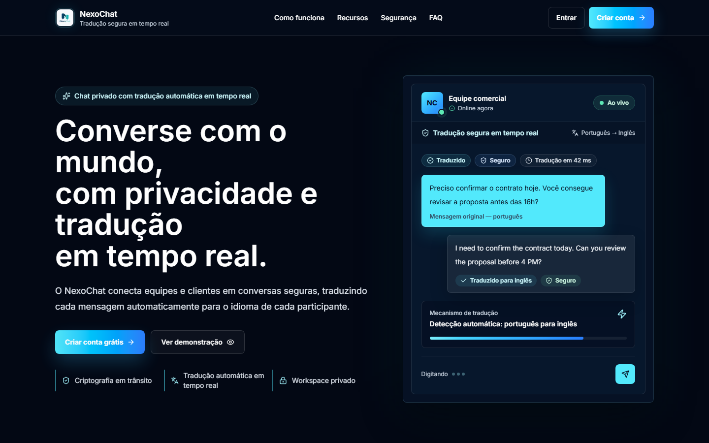

<picture>
  <source media="(prefers-color-scheme: dark)" srcset="./assets/hero-dark.svg">
  <source media="(prefers-color-scheme: light)" srcset="./assets/hero-light.svg">
  
</picture>

 

  
  
  

  <strong>Full-Stack Developer at Prime Secure</strong> 
  São Paulo, Brazil · Portuguese, French, and Haitian Creole

---

## I build the product, not just the screen

I am a **Full-Stack Developer** with a bachelor's degree in Computer Science, building web products from interface and business logic to data, integrations, testing, and deployment.

My core stack is **TypeScript, React, Next.js, Node.js, and PostgreSQL**. I care about the details that make software dependable in production: clear architecture, strong validation, secure authentication, automated delivery, and interfaces that feel intentional.

My background in **automation, Business Intelligence, and visual design** helps me connect engineering decisions with user experience and real operational needs.

> I turn business context into maintainable software that teams can confidently use and evolve.

---

## Selected work

### NexoChat — Private real-time chat with automatic translation

**NexoChat** is a responsive 1:1 messaging platform that lets each participant write and receive messages in their preferred language. It combines private conversations, automatic translation, online presence, delivery and read states, and bilingual message history.

  
  

**Engineering highlights**

- Real-time messaging and presence with **Ably**, with backend-issued authentication.
- Automatic language detection and translation through the **DeepL API**.
- Authentication with signed **JWTs in HttpOnly cookies**, CSRF protection, route guards, and IP rate limiting.
- Shared client/server validation with **Zod**, relational persistence with **PostgreSQL and Prisma**, and password hashing with **bcrypt**.
- Media management with **Cloudinary**, transactional email with **Resend**, and secrets management with **Infisical**.
- GitHub Actions quality gate controlling preview and production deployments on **Vercel**.

`Next.js 16` · `TypeScript` · `PostgreSQL` · `Prisma` · `Tailwind CSS` · `Ably` · `DeepL` · `Cloudinary` · `Resend`

---

### Personal Portfolio — Engineering, process, and case studies

A multilingual portfolio that presents my experience, delivery process, and selected work through a responsive, motion-led interface.

- **Focus:** Clear professional positioning, project storytelling, accessibility, performance, and responsive UX.
- **Built with:** Next.js, React, TypeScript, Tailwind CSS, and Framer Motion.
- **My role:** Product direction, visual design, development, content structure, and deployment.

**[Explore the portfolio →](https://wolkendo.dev/en)**

---

### AppPonto — Attendance and workflow automation

An internal time-tracking solution developed during my internship at the São Paulo Court of Justice. It standardized attendance records, simplified operational follow-up, and connected reporting with automated communication.

- **Capabilities:** Entry and exit records, work-mode tracking, management filters, Power BI reporting, and automated email notifications.
- **Built with:** Power Apps, SharePoint, Power Automate, Power BI, and Microsoft 365.
- **My contribution:** Requirements analysis, application development, integrations, business rules, UI design, validation, and documentation.
- **Availability:** Public case documentation and screenshots; the original corporate application is not distributed.

**[View the documented case →](https://github.com/maestrowoldo/Aplicativo---Ponto---Power-Apps)**

---

## Core toolkit

**Product interfaces**

**APIs and data**

**Quality and delivery**

**Automation and insights**

---

## Experience at a glance

| Period | Role | Focus |
|---|---|---|
| **Nov 2025 — Present** | **Full-Stack Developer · Prime Secure** | React and Next.js interfaces, Node.js APIs, relational data, validation, testing, and deployment. |
| **Sep 2025 — Nov 2025** | **IT Support Analyst · DXC Technology** | Onboarding, offboarding, hardware and software support, and infrastructure operations. |
| **Sep 2024 — Sep 2025** | **IT Intern · São Paulo Court of Justice** | Process automation, Power Platform applications, Power BI, SharePoint, and Bizagi. |

  <strong>Education:</strong> Bachelor's degree in Computer Science 
  <strong>Languages:</strong> Portuguese, French, and Haitian Creole

---

## GitHub activity

---

### Have a product, integration, or workflow to build?

I am open to conversations about **full-stack development, web products, APIs, automation, and technical collaboration**.

  <a href="mailto:maestrowoldo97@gmail.com"><strong>Email me</strong></a>
  &nbsp;·&nbsp;
  <a href="https://www.linkedin.com/in/wolkendo-arias"><strong>Connect on LinkedIn</strong></a>
  &nbsp;·&nbsp;
  <a href="https://wolkendo.dev/en"><strong>View my portfolio</strong></a>

Clear interfaces · Maintainable systems · Reliable delivery

