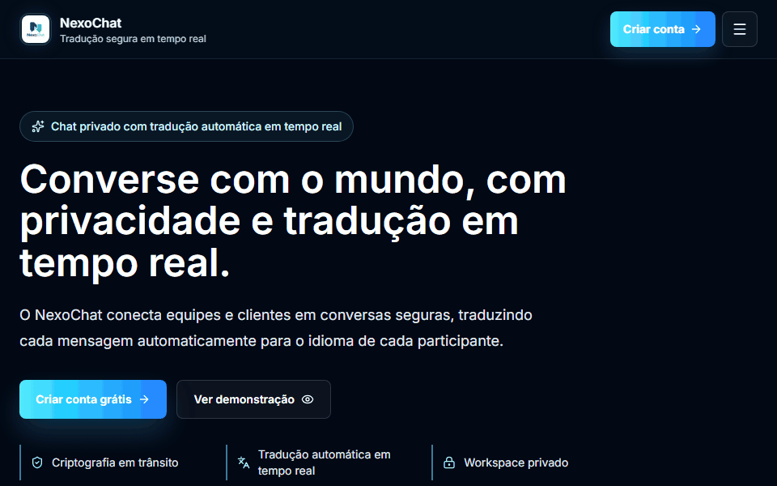

<picture>
  <source media="(max-width: 640px) and (prefers-color-scheme: dark)" srcset="./assets/hero-mobile-dark.svg">
  <source media="(max-width: 640px) and (prefers-color-scheme: light)" srcset="./assets/hero-mobile-light.svg">
  <source media="(prefers-color-scheme: dark)" srcset="./assets/hero-dark.svg">
  <source media="(prefers-color-scheme: light)" srcset="./assets/hero-light.svg">
  
</picture>

<h1>Full-Stack Developer building production-ready web products</h1>

  <strong>Wolkendo Arias · Full-Stack Developer at Prime Secure</strong>

  I take products from interface and business logic to data, integrations, testing, and deployment.

  <strong>São Paulo, Brazil</strong> · Available for remote opportunities worldwide

  <a href="https://wolkendo.dev/en"><strong>Portfolio</strong></a>
  &nbsp;·&nbsp;
  <a href="https://www.linkedin.com/in/wolkendo-arias"><strong>LinkedIn</strong></a>
  &nbsp;·&nbsp;
  <a href="mailto:maestrowoldo97@gmail.com"><strong>Email</strong></a>

---

## Selected work

### NexoChat — Private conversations across languages

[NexoChat](https://nexochat.vercel.app/) is a responsive one-to-one messaging product that lets each participant write and receive messages in their preferred language. I designed and implemented the experience end to end, from product flows and real-time behavior to security, data, integrations, tests, and deployment.

<a href="https://nexochat.vercel.app/">
  <picture>
    <source media="(prefers-reduced-motion: reduce)" srcset="./assets/nexochat-preview.png">
    
  </picture>
</a>

  The demo shows a Portuguese interface with Portuguese-to-English translation. A static preview is used when reduced motion is preferred.

**Engineering highlights**

- Built real-time messaging, online presence, delivery states, and read states with Ably and backend-issued authentication.
- Added automatic language detection and translation through the DeepL API while preserving the original and translated message history.
- Secured the application with signed JWTs in HttpOnly cookies, CSRF protection, route guards, password hashing, and IP rate limiting.
- Modeled relational data with PostgreSQL and Prisma, with shared client/server validation through Zod.
- Integrated Cloudinary for media and Resend for transactional email, with secrets managed through Infisical.
- Established automated quality gates in GitHub Actions for tested preview and production deployments on Vercel.

**Stack:** Next.js 16, TypeScript, PostgreSQL, Prisma, Tailwind CSS, Ably, DeepL, Cloudinary, Resend

**[Open the live product →](https://nexochat.vercel.app/)** · Source code is private

---

### Personal Portfolio — Professional storytelling through product design

A multilingual portfolio that presents my experience, delivery process, and selected work through a responsive and accessible interface.

**Contribution:** Product direction, visual design, front-end development, content architecture, performance, and deployment 
**Stack:** Next.js, React, TypeScript, Tailwind CSS, Framer Motion

**[Explore the portfolio →](https://wolkendo.dev/en)**

---

### AppPonto — Attendance and workflow automation

An internal time-tracking solution developed during my internship at the São Paulo Court of Justice. It standardized attendance records, simplified operational follow-up, and connected reporting with automated communication.

**Contribution:** Requirements analysis, application development, business rules, integrations, UI design, validation, and documentation 
**Stack:** Power Apps, SharePoint, Power Automate, Power BI, Microsoft 365 
**Availability:** Public case documentation and screenshots; the original corporate application is not distributed

**[View the documented case →](https://github.com/maestrowoldo/Registro-de-Ponto)**

---

## Core capabilities

- **Interfaces & product:** TypeScript, React, Next.js, Tailwind CSS, responsive UI, accessibility, interaction design, and Figma.
- **APIs & data:** Node.js, REST APIs, PostgreSQL, Prisma, authentication, third-party integrations, and Zod validation.
- **Quality & delivery:** Vitest, Jest, GitHub Actions, Docker, Vercel, AWS, secure configuration, and production deployment.
- **Automation & insights:** Power Apps, Power Automate, SharePoint, Power BI, workflow design, and operational reporting.

My background across software engineering, automation, Business Intelligence, and visual design helps me connect technical decisions with user experience and business needs.

---

## Experience

**Full-Stack Developer · Prime Secure** 
*November 2025 — Present* 
Building React and Next.js interfaces, Node.js APIs, relational data flows, validation, automated tests, and production delivery.

**IT Support Analyst · DXC Technology** 
*September 2025 — November 2025* 
Supported onboarding, offboarding, hardware, software, and infrastructure operations in an enterprise environment.

**IT Intern · São Paulo Court of Justice** 
*September 2024 — September 2025* 
Developed process automation, Power Platform applications, Power BI reporting, SharePoint solutions, and Bizagi workflows.

---

## Education and languages

**Bachelor's degree in Computer Science** 
Universidade Cruzeiro do Sul · Completed December 2025

**Languages**

- French and Haitian Creole — Native
- Portuguese — Fluent
- English — Intermediate

---

<h2>Open to full-stack opportunities</h2>

  I welcome conversations with recruiters and engineering teams hiring for remote full-stack roles worldwide, especially where product thinking, reliable systems, and end-to-end ownership matter.

  <a href="mailto:maestrowoldo97@gmail.com"><strong>Start a conversation by email</strong></a>
  &nbsp;·&nbsp;
  <a href="https://www.linkedin.com/in/wolkendo-arias"><strong>Connect on LinkedIn</strong></a>

